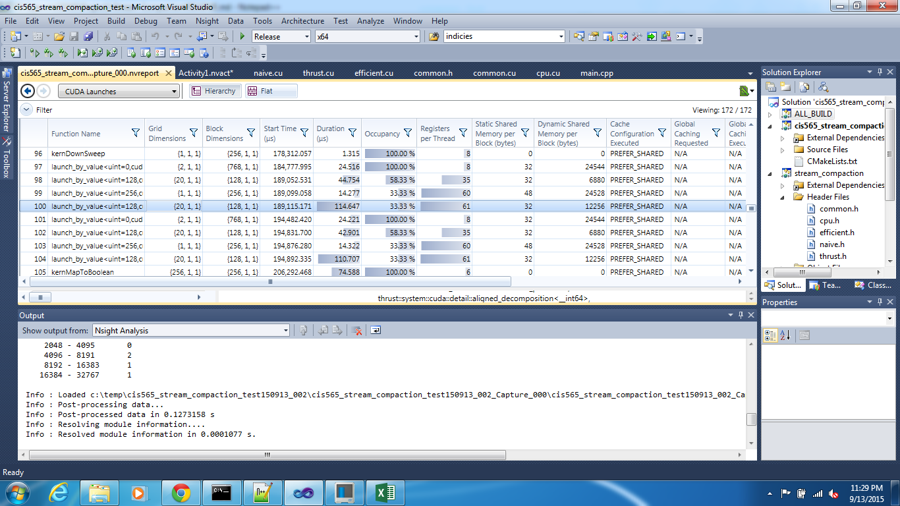

CUDA Stream Compaction
======================

**University of Pennsylvania, CIS 565: GPU Programming and Architecture, Project 2**

* Nada Ouf
* Tested on: Windows 7, i7-2649M @ 2.80GHz 8GB, GTX 520 1024MB

### Performance Analysis

##Timing for different problem size

After testing different block sizes for both the naive and work-efficient implementations a block size of 256 achieved the best performance results.
The timing results below are measured using a block size of 256.

These are the execution times for naive, work-efficient and thrust GPU implementations.
The vertical axis is a logarithmic scale with base 10 that represents the time in ms. 
The horizontal axis is the problem size n.

##Nsight analysis

Comparing the time taken by the thrust library, according to the Nsight analysis some of the function calls have very low occupancy which may be because
it used a lot of registers or a low number of threads per block.

##Explanation of results

The naive implementation is better in performance because:
- all branches are outside the kernal functions
- the need to copy results from a temporary array to the device output array was eleminated

In my opinion work-efficient is slower than expected because my implementation includes branches in while all the loops are outside the kernal functions.
The work-efficient implementation still needs to be optimized.

##Test program output
<pre><code>
****************
** SCAN TESTS **
****************
    [  30  36  43  30  43  27  43  21  31  32  19  22  15 ...  12   0 ]
==== cpu scan, power-of-two ====
    [   0  30  66 109 139 182 209 252 273 304 336 355 377 ... 1634700 1634712 ]
==== cpu scan, non-power-of-two ====
    [   0  30  66 109 139 182 209 252 273 304 336 355 377 ... 1634589 1634618 ]
    passed
==== naive scan, power-of-two ====
time is 0.886432 ms on the GPU
    [   0  30  66 109 139 182 209 252 273 304 336 355 377 ... 1634700 1634712 ]
    passed
==== naive scan, non-power-of-two ====
time is 0.896960 ms on the GPU
    [   0  30  66 109 139 182 209 252 273 304 336 355 377 ...   0   0 ]
    passed
==== work-efficient scan, power-of-two ====
time is 1.020288 ms on the GPU
    [   0  30  66 109 139 182 209 252 273 304 336 355 377 ... 1634700 1634712 ]
    passed
==== work-efficient scan, non-power-of-two ====
time is 1.020128 ms on the GPU
    [   0  30  66 109 139 182 209 252 273 304 336 355 377 ... 1634589 1634618 ]
    passed
==== thrust scan, power-of-two ====
time is 3.317376 ms on the GPU
    [   0  30  66 109 139 182 209 252 273 304 336 355 377 ... 1634700 1634712 ]
    passed
==== thrust scan, non-power-of-two ====
time is 0.444320 ms on the GPU
    [   0  30  66 109 139 182 209 252 273 304 336 355 377 ... 1634589 1634618 ]
    passed

*****************************
** STREAM COMPACTION TESTS **
*****************************
    [   2   3   4   3   4   2   4   2   3   3   1   2   1 ...   1   0 ]
==== cpu compact without scan, power-of-two ====
    [   2   3   4   3   4   2   4   2   3   3   1   2   1 ...   3   1 ]
    passed
==== cpu compact without scan, non-power-of-two ====
    [   2   3   4   3   4   2   4   2   3   3   1   2   1 ...   2   4 ]
    passed
==== cpu compact with scan ====
    [   2   3   4   3   4   2   4   2   3   3   1   2   1 ...   3   1 ]
    passed
==== work-efficient compact, power-of-two ====
time is 1.023168 ms on the GPU
    [   2   3   4   3   4   2   4   2   3   3   1   2   1 ...   3   1 ]
    passed
==== work-efficient compact, non-power-of-two ====
time is 1.013376 ms on the GPU
    [   2   3   4   3   4   2   4   2   3   3   1   2   1 ...   2   4 ]
    passed 
</code></pre>

