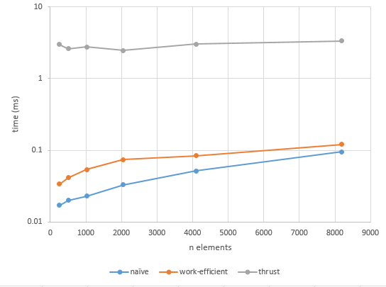

CUDA Stream Compaction
======================

**University of Pennsylvania, CIS 565: GPU Programming and Architecture, Project 2**

* Nada Ouf
* Tested on: Windows 7, i7-2649M @ 2.80GHz 8GB, GTX 520 1024MB

### Performance Analysis

##Timing for different problem size

After testing different block sizes for both the naive and work-efficient implementations a block size of 256 achieved the best performance results.
The timing results below are measured using a block size of 256.

These are the execution times for naive, work-efficient and thrust GPU implementations.
The vertical axis is a logarithmic scale with base 10 that represents the time in ms. 
The horizontal axis is the problem size n.

##Explanation of results

The naive implementation is better in performance because:
- all branches are outside the kernal functions
- the need to copy results from a temporary array to the device output array was eleminated

In my opinion work-efficient is slower than expected because my implementation includes branches in the kernal function. I want to try and eliminate them.

##Test program output
<pre><code>
 Test code
 
 Test
 
</code></pre>

